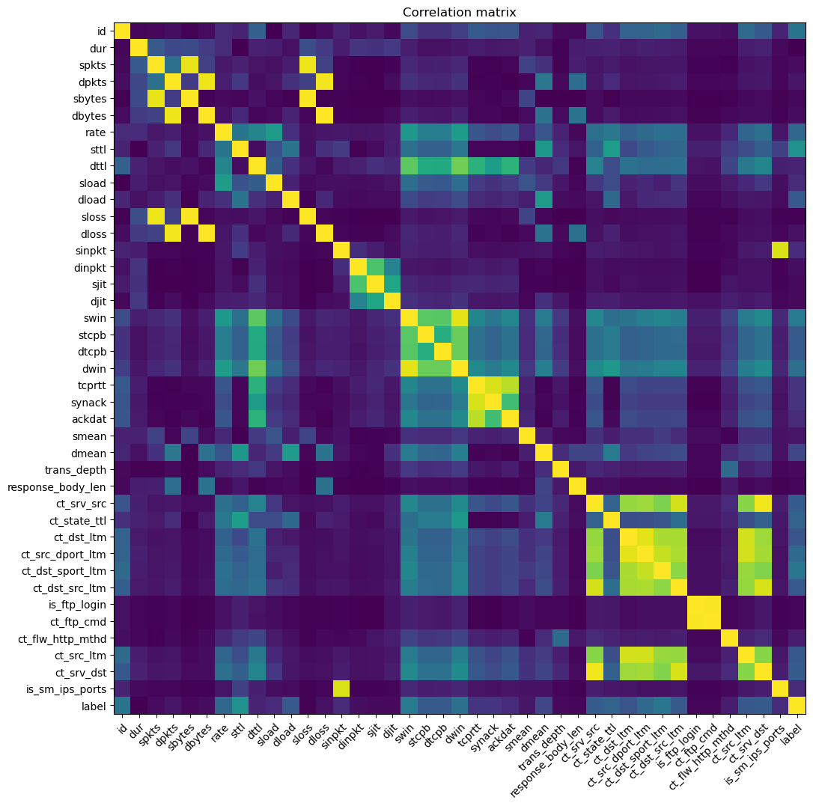
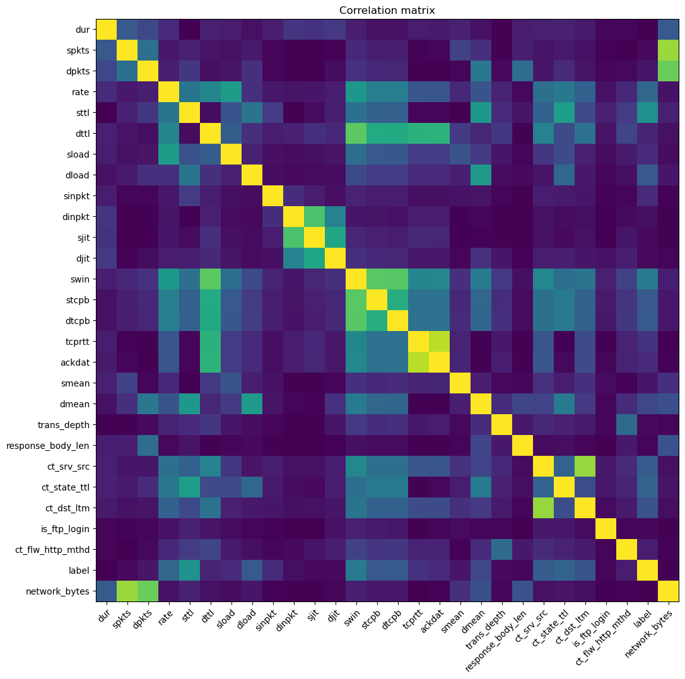

# Adventures in Data Wrangling: CPS330 Final
## Introduction
For my final project, I decided to build an Intrusion Detection System. I've been interested in cybersecurity since high school, and wanted to take the opportunity to develop my knowledge of the subject while creating this project. 

## Intrusion Detection Systems
An intrusion detection system (IDS) is a device or software application that monitors a network or systems for malicious activity or policy violations. Any intrusion activity or violation is typically either reported to an administrator or collected centrally using a security information and event management system ([Wikipedia](https://en.wikipedia.org/wiki/Intrusion_detection_system)). Some systems can even respond automatically! Intrusion detection systems usually work one of four ways:
### Signature-based
This is probably the most straightforward kind of system. A signature-based IDS has a database of attack signatures that it keeps updated. It compares network or system activity to its database, and when it finds a match it flags the activity as potentially malicious.

Unfortunately, this has the major disadvantage of being useless against attacks that aren't in its database. New attacks are developed constantly, so any failure to keep the database up-to-date can result in undetected malicious activity.

Pros: 

- Straightforward approach

Cons:

- Misses unknown attacks
- requires constant updating

### Anomaly-based
This method takes a more suspicious approach. Instead of comparing network traffic against known attacks, it compares network traffic with a model of what normal network traffic looks like. This allows anomaly-based detection to flag entirely unknown attacks, since anything that doesn't look normal is regarded as suspicious. This can backfire, however, since even valid use can be flagged as malicious.

Pros:

- Detects unknown attacks

Cons:

- Produces false positives at unusual, but not malicious, network usage

### Stateful protocol analysis
Stateful Protocol Analysis (SPA) works by scanning *network flow*, as opposed to scanning individual packets for malicious content. It's quite effective at detecting attacks, but because it needs to keep track of so much it has massive ram requirements and can slow down networks.

Pros:

- Can see patterns other methods have trouble detecting

Cons:

- High resource consumption due to maintaining state information

### Neural Network 
Using a neural network for intrusion detection seems like an ideal implementation. After all, neural networks, like SPA, are excellent at detecting patterns in traffic, but are far cheaper to run computationally. Like standard anomaly-based detection, they can detect anomalies in packets, while also being able to identify known attacks like signature-based detection. 

Pros:

- Finding unpredictable patterns in lots of complex data - the perfect application!
- Can be used both to identify attacks and to flag unusual network use
- CNN allows for finding more complex pattern compared with a fully-connected model

Cons:

- None?
## Starting out
I began my project with the idea of building a demo application. After all, I figured, there were so many examples on the internet that I could surely have an effective model in no time, right? After all, machine learning models are the backbone of the intrusion detection industry. 

I quickly realized the error of my ways, While I had found many examples, most of them were either outside the scope of my project, not what I wanted to do (they didn't look at packet relations, for example), or were so far above my head I didn't know how to comprehend them. I reduced the scope of my project to a single Jupyter notebook, and decided that I wanted to create a convolutional neural network (CNN) to identify attacks, based on a paper I found, ["Network Intrusion Detection System using Deep Learning"](https://doi.org/10.1016/j.procs.2021.05.025). The paper, by Lirim Ashiku and Cihan Dagli, outlines the creation process of an incredibly powerful intrusion detection system using the [UNSW-NB15 dataset](https://research.unsw.edu.au/projects/unsw-nb15-dataset), reporting a 97% accuracy (state-of-the-art models at the time the paper was written had ~93% accuracy).

# Implementation <!-- 2-3 min -->

While Colab worked well enough for most of the assignments, I didn't want to deal with its unreliability, especially as I hoped to be training massive neural networks. I also didn't really want to run notebooks directly on my laptop, as simply closing the lid is enough to stop a notebook from running. Instead, I programmed the bulk of my project on [malachi](malachi.cs.gordon.edu), using the [Remote - SSH](https://marketplace.visualstudio.com/items?itemName=ms-vscode-remote.remote-ssh) extension on my own machine when I couldn't be in the lab. I hosted my work [on Github](https://github.com/fishyfishfish55/cps330), which allowed me to keep track of my project, and roll things back when I made a mistake.

## Preparing the data

Preparing the dataset for use was, for the most part, simple. Separate training and testing CSV files were included in the dataset I downloaded, so loading them was quite simple.

A file called `NUSW-NB15_features.csv` was also included in the files I found. It purported itself to contain an explanation of all the 40+ features in the training and testing datasets. Unfortunately, many of the features were misspelled or missing, so I had some difficulty understanding what data I was working with. I sunk probably more time than I needed in a futile attempt to grok each feature, especially considering the numerous examples that simply deleted largely the same columns from the dataset, which, while mysterious, weren't terribly correlated with the packet's labels.

### Data cleaning and Feature Engineering

I had minimal data cleaning to do. The only column with missing values was the `Service` column, which contained the highest-level service a packet used. Less commonly-used services had a `-` in place of the name of the service. I changed the `-` to a more pythonic `None`.

After scrubbing the data, I created a correlation matrix diagram.

As is apparent from the diagram, some features are quite highly correlated. I engineered a single feature to replace a lot of the highly correlated features, then removed them. After doing this, I got a much cleaner dataset.

### Adventures in Convolutional Neural Networks

It was finally time to create my model! As outlined in my paper, I attempted to create a 1-dimensional Convolutional Neural Network for packet classification. I dove into learning about CNN's, and quickly learned that a 1-dimensional CNN actually takes a 3-dimensional input, as the data is expected to be spread over time. This makes a lot of sense, as without multidimensional data, there's not much for a convolution to convolute over.

It was at this point I noticed a critical flaw in my design.

A one-dimensional CNN requires 3-dimensional dataset of data *over time*. While time data was reported to exist in the (rather unreliable) `NUSW-NB15_features.csv`, it was not present in either the training or the testing datasets. In fact, *every* column that I had noticed was missing from `NUSW-NB15_features.csv` was related to time data in one way or another.

I know this data exists somewhere out there, tucked away in cyberspace. If I had planned better, I would have found the timeframe data and shaped the dataset around it, trained my network, and recorded my results. Unfortunately, like my dataset, I was out of time. With hours left on the clock until my presentation was due, I recorded and submitted a presentation of my attempt. 

# Takeaways <!-- 1 min -->

Despite my project's outward failure, I learned a lot through my project. Here are a few of my takeaways

## Don't get stuck on little things!

My technical explorations could definitely have been more connected to my project. One especially that was related to packet analysis wasn't really relevant to what I wanted to do. I would also be more wary about using datasets with large amounts of unnecessary features. While having so many things to explore was fun, I ended up spending more time on data analysis than was probably necessary.

## Networks and packets are complicated beasts

There is a lot that goes into creating a network and analyzing a network. While it was fun to look at different fields and play around with packets, I feel like I learned a good bit about what information can be gained from a network scan.

## Convolutional neural networks are an extremely powerful tool

I barely grazed the surface of learning about CNN's. While we did an example project in class, there's so much more out there related to these neural networks. I'd definitely be interested in doing my own projects with CNN's over winter break.

## Citations
The dataset I used, the UNSW-NB15, requires people to cite a few other papers when referencing it. Here they are.

- Moustafa, Nour, and Jill Slay. "UNSW-NB15: a comprehensive data set for network intrusion detection systems (UNSW-NB15 network data set)." Military Communications and Information Systems Conference (MilCIS), 2015. IEEE, 2015.

- Moustafa, Nour, and Jill Slay. "The evaluation of Network Anomaly Detection Systems: Statistical analysis of the UNSW-NB15 dataset and the comparison with the KDD99 dataset." Information Security Journal: A Global Perspective (2016): 1-14.

- Moustafa, Nour, et al. "Novel geometric area analysis technique for anomaly detection using trapezoidal area estimation on large-scale networks." IEEE Transactions on Big Data (2017).

- Moustafa, Nour, et al. "Big data analytics for intrusion detection system: statistical decision-making using finite dirichlet mixture models." Data Analytics and Decision Support for Cybersecurity. Springer, Cham, 2017. 127-156.

- Sarhan, Mohanad, Siamak Layeghy, Nour Moustafa, and Marius Portmann. NetFlow Datasets for Machine Learning-Based Network Intrusion Detection Systems. In Big Data Technologies and Applications: 10th EAI International Conference, BDTA 2020, and 13th EAI International Conference on Wireless Internet, WiCON 2020, Virtual Event, December 11, 2020, Proceedings (p. 117). Springer Nature.

I'd also like to thank [Hashehri](https://github.com/Hashehri) for their project, [Detecting Malicious Attacks Through The Network Traffic](https://github.com/Hashehri/Network-Traffic-Classification-UNSW-NB15). The notebook was an immense help to me in understanding the data I was working with, and I borrowed quite a bit of code for my own notebook.